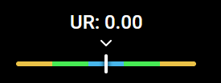
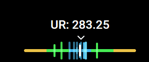
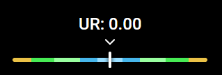
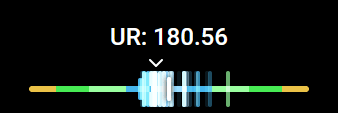
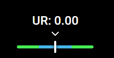
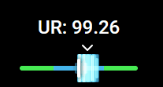
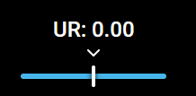
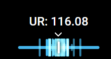

# HitErrorMeter by KapiWilq

  </a>

|                 |                     |
| --------------- | ------------------- |
| For             | ingame, obs-overlay |
| Compatible with | tosu                |
| Size            | 500 x 100           |

> Supports all rulesets! (except mania converts, support for those is coming soon™) | The resolution above is for default settings at OD0 in the osu! ruleset.

## Gameplay preview

**Note**: The GIFs might make the overlay look pretty bad, I promise it looks better in person.

### osu! (OD10 for this example)

  

### osu!mania (OD8.2 for this example)

  

### osu!taiko (OD7 for this example)

  

### osu!catch (disabled by default; any CS)

  

## How to install (manually)

0. Remember to have both your game and `tosu` open! I've seen some people wondering why their stuff is not working only to find out neither was open.
1. Click the `Download the overlay` button at the top of this **document**.
2. Put the folder that is inside the zip into the `static` folder next to the `tosu` executable.
3. Add the overlay as a browser source with the properties in the table below the download button.
4. (Optionally) Go to the tosu dashboard (the default address is http://127.0.0.1:24050), find the overlay in the `Installed` section, and customize it to your liking. There's a few settings waiting for you!

## Settings

| Setting                                    | Type     | Default value |
| ------------------------------------------ | -------- | ------------- |
| Hit error meter scale                      | number   | 1             |
| Unstable Rate display scale                | number   | 1             |
| Automatically hide the in-game score meter | checkbox | true          |
| Show the hit error meter in osu!catch      | checkbox | false         |
| Show hit windows                           | checkbox | true          |
| Show the moving average arrow              | checkbox | true          |
| Show the Unstable Rate display             | checkbox | true          |
| 320's hit window colo(u)r                  | color    | #99ddff       |
| 300's hit window colo(u)r                  | color    | #47b6eb       |
| 200's hit window colo(u)r                  | color    | #99ffa0       |
| 100's hit window colo(u)r                  | color    | #47eb54       |
| 50's hit window colo(u)r                   | color    | #ebc247       |
| Height of the main tick (in pixels)        | number   | 24            |
| Height of hit error ticks (in px)          | number   | 36            |
| Width of hit error ticks (in px)           | number   | 4             |
| Width multiplier of hit windows            | number   | 1             |

## Roadmap to v1.0
- [ ] Add support for mania converts (current status: waiting for the property in the JSON response to be able to support this (either that, or changing the `beatmap.mode` to return the ruleset that the map was originally created for), see [the conversation in the tosu support server](https://discord.com/channels/1056534107330445362/1185957776665628764/1302703274125824102))
- [ ] Add support for StreamCompanion ~~and gosumemory~~ actually no gosu support - that would be maintaining a third different version of the overlay with no real benefit, since gosu is probably abandoned by this point (maybe in 1.1???)
- [X] Add support for hiding the in-game score meter (100% background dim only for now)

## Support

If you have any questions or problems with the overlay, ask either here on GitHub, or send me a DM on Discord as long as it's not something related to modifying the overlay files directly (e.g. feature requests are okay). I'm in the tosu support server, so you can find me more easily this way! (For validating | Username: `kapiwilq`; ID: `147791290908672000`)
